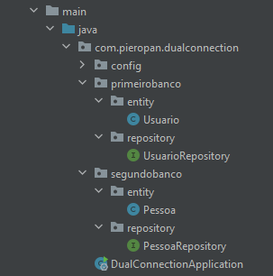
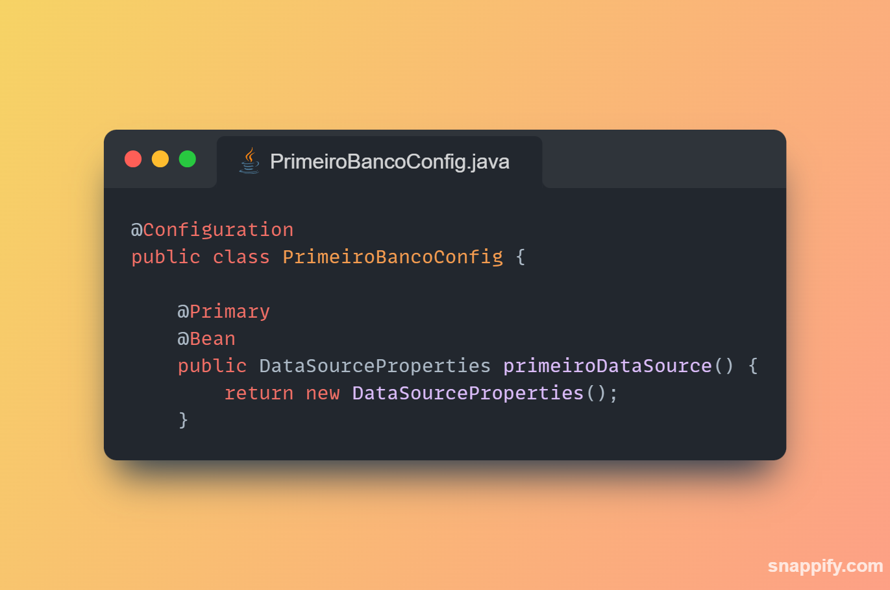
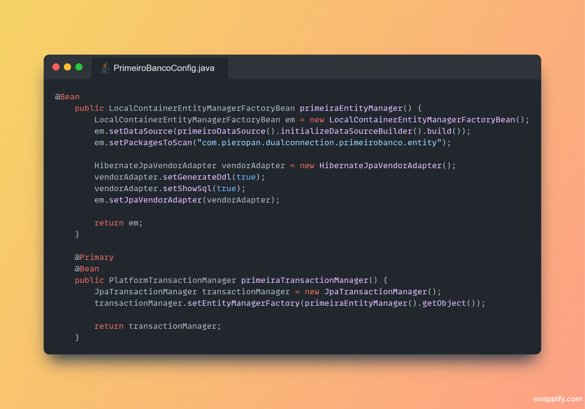
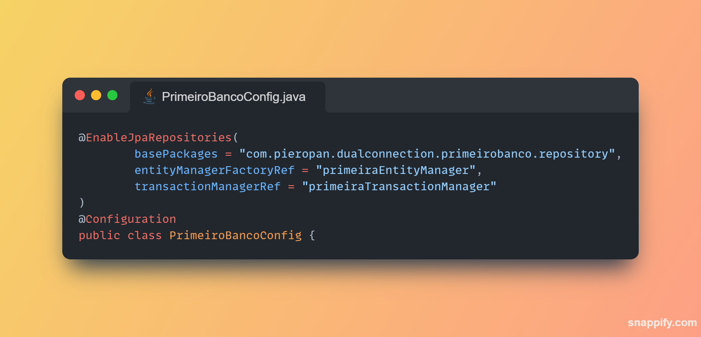

#### *Projeto com finalidade de mostrar como realizar a configuração de múltiplos bancos de dados utilizando o Spring Data JPA*

| Tecnologia  | Versão   |
| ------------ | ------------ |
|org.springframework.boot   |  3.2.0 |

No vídeo, configuramos inicialmente a estrutura de pastas conforme imagem abaixo.

primeirobanco -> entity e repository  
segundobanco -> entity e repository    

### CONFIGURAÇÃO

Implementamos a configuração dos bancos em classe de configuração separada. Falaremos da _PrimeiroBancoConfig.java_

No print abaixo, temos a criação do @Bean DataSourceProperties.

Por padrão, o DataSourceProperties utiliza o @ConfigurationProperties com o prefixo "spring.datasource".
Isso significa que você deve ter properties no seu application.properties com esse sufixo.

Pra quem já está acostumado a trabalhar com o JPA, é basicamente aquelas properties padrão
que utilizamos no dia a dia.

Exemplo das properties

* spring.datasource.driverClassName
* spring.datasource.url
* spring.datasource.username
* spring.datasource.password

### LocalContainerEntityManagerFactoryBean e PlatformTransactionManager

O primeiro @Bean tem como objetivo definitir um EntityManagerFactory.
Precisamos passar algumas informações para ele, como o dataSource (criado anteriormente),
os pacotes que serão escaneados (no caso seria o pacote entity da pasta primeirobanco)

Além de definir uma implementação para o JPA que seria HibernateJpaVendorAdapter.
Com essa classe do hibernate, podemos definitir se queremos o DDL como true, ou seja,
deixar aplicação criar as tabelas automaticamente, podemos definir exibição dos logs etc.

Já o segundo @Bean define uma plataforma de transação, nela devemos passar o EntityManager
criado no método anterior.

### FINALIZANDO

Para finalizarmos, devemos implemetar a anotação @EnableJpaRepositories
e passar pra ela a referência da entityManagerFactory, transactionManager e os pacotes
onde se encontram os repositórios, no caso em: _"com.pieropan.dualconnection.primeirobanco.repository"_

Basta realizamos o mesmo procedimento com os demais bancos. Criando novas classes
de configurações e específicando onde se encontram os pacotes de repositório e entity

